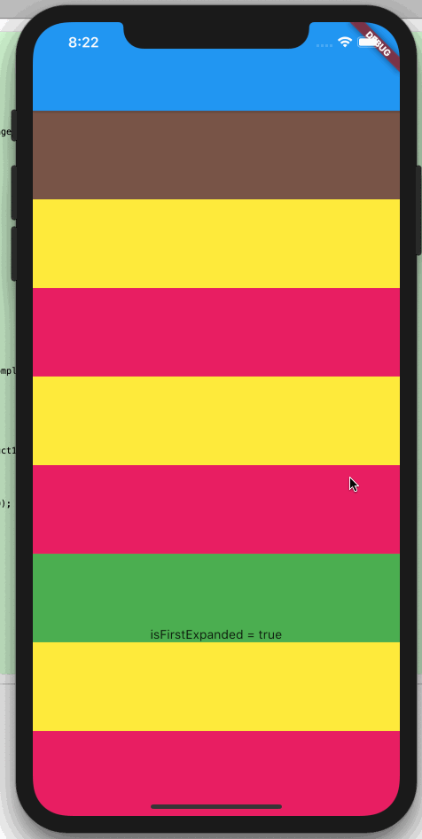

# flutter_listview_collapsed_item_issue

Shows a bug with `ListView` and collapsed (0 height) widgets.

Initially expanded the collapsed wigdet works by clicking the text. But after it has been scrolled out of view with a 0 height, it can never be made visbile again.

